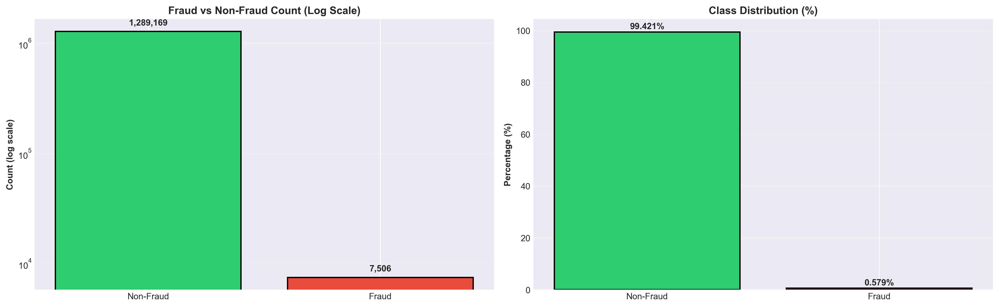
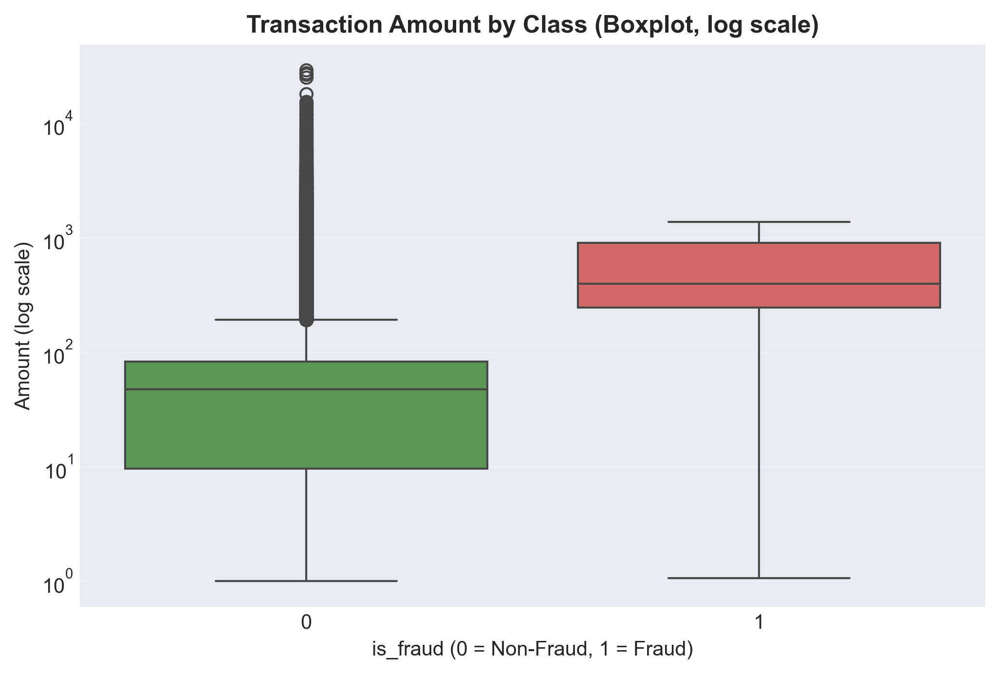

# Data Overview

## Source

The dataset is sourced from Kaggle, provided as two pre-defined splits:
- `fraudTrain.csv` — training set
- `fraudTest.csv` — test set

The data simulates credit card transactions made by US cardholders between
January 2019 and December 2020, covering transactions from 1,000 customers
across 800 merchants.

---

## Dataset Summary

| Split | Transactions | Fraud Cases | Fraud Rate |
|-------|-------------|-------------|------------|
| Train | 1,296,675   | 7,506       | 0.579%     |
| Test  | 555,719     | 2,145       | 0.386%     |

The dataset exhibits severe class imbalance, with fraudulent transactions
representing less than 0.6% of the training set. This imbalance is
representative of real-world fraud rates and is the central challenge
of this project.

---

## Feature Description

The raw dataset contains 23 columns, categorized as follows:

### 1. Identifiers (Dropped)

| Column | Type | Description |
|--------|------|-------------|
| `Unnamed: 0` | Numeric | Row index with no predictive value |
| `cc_num` | Numeric | Credit card number — sensitive identifier, not used in modeling |
| `trans_num` | Object | Unique transaction identifier, used for tracking not modeling |
| `first` | Object | Cardholder first name — no predictive value |
| `last` | Object | Cardholder last name — no predictive value |

### 2. Time-Based Features

| Column | Type | Description |
|--------|------|-------------|
| `trans_date_trans_time` | Object | Full timestamp of the transaction |
| `unix_time` | Numeric | Transaction timestamp in Unix format |

### 3. Transaction & Cardholder Features

| Column | Type | Description |
|--------|------|-------------|
| `merchant` | Object | Name of the merchant where the transaction occurred |
| `category` | Object | Category of goods or services purchased |
| `amt` | Numeric | Transaction amount in USD |
| `gender` | Object | Cardholder gender |
| `city_pop` | Numeric | Population of the cardholder's city |
| `job` | Object | Cardholder occupation |
| `dob` | Object | Cardholder date of birth |

### 4. Geographic Features

| Column | Type | Description |
|--------|------|-------------|
| `street` | Object | Street address of the cardholder |
| `city` | Object | City of the cardholder |
| `state` | Object | State of the cardholder |
| `zip` | Numeric | ZIP code of the cardholder |
| `lat` | Numeric | Latitude of the cardholder's location |
| `long` | Numeric | Longitude of the cardholder's location |
| `merch_lat` | Numeric | Latitude of the merchant's location |
| `merch_long` | Numeric | Longitude of the merchant's location |

### 5. Target Variable

| Column | Type | Description |
|--------|------|-------------|
| `is_fraud` | Numeric | Binary label — 1 for fraudulent, 0 for legitimate |

---

## Data Quality

| Issue | Status |
|-------|--------|
| Missing values | None |
| Duplicate transactions | None |
| Class imbalance | Severe — ~0.38% fraud rate |
| Outliers in `amt` | Present, but informative |

### Note on Transaction Amount Outliers

Outliers in `amt` are not treated as noise and are intentionally retained.
Analysis shows that the mean transaction amount for fraudulent transactions
is significantly higher than for legitimate ones, and extreme values in `amt`
tend to cluster in the fraud class. Removing or capping these outliers would
suppress a genuine fraud signal.

### Note on Leakage Risk

`trans_date_trans_time` is dropped after feature extraction to avoid
redundancy with `unix_time`. Target encoding (fraud rates by merchant,
category, and city) is computed using out-of-fold estimation on the
training set only, then applied to the test set — ensuring no leakage
from the target variable.

---

## Sources

- [Kaggle Dataset — Credit Card Fraud Detection (Kartik Shenoy)](https://www.kaggle.com/datasets/kartik2112/fraud-detection)
  — Please verify dataset description details (date range, number of customers/merchants)
  against the Kaggle page directly.