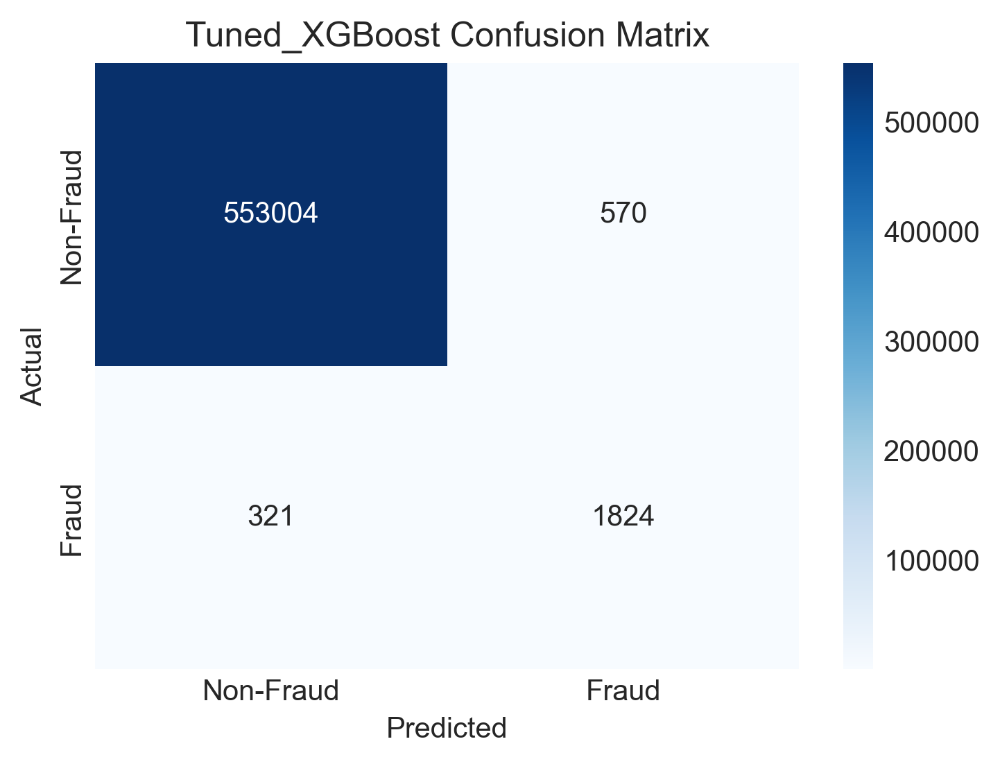
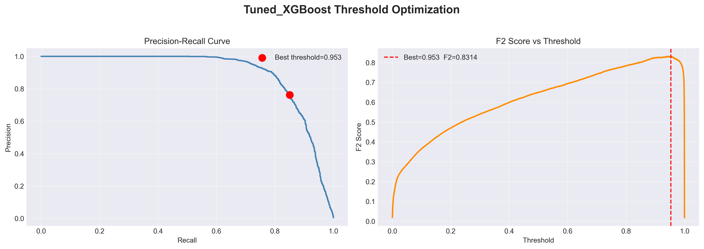

# Results

## Overview

This document presents the evaluation results for all five models after
feature selection, followed by the final tuned XGBoost results after
Optuna hyperparameter optimization and threshold tuning.

---

## Baseline Model Comparison

All models were evaluated on the same 9 features with `scale_pos_weight=171.75`
and default threshold (0.5), except MLP which used its own optimized threshold.

| Model | Precision | Recall | F2-Score | PR-AUC | ROC-AUC | False Alert Rate |
|-------|-----------|--------|----------|--------|---------|-----------------|
| Logistic Regression | 4.82% | 74.27% | 0.1915 | 0.1298 | 0.8352 | 5.67% |
| Random Forest | 94.09% | 77.95% | 0.8072 | 0.8948 | 0.9838 | 0.019% |
| LightGBM | 31.65% | 94.73% | 0.6773 | 0.8854 | 0.9962 | 0.793% |
| XGBoost | 65.63% | 86.25% | 0.8115 | 0.8872 | 0.9965 | 0.175% |
| MLP (thr=0.9659) | 66.29% | 81.21% | 0.7771 | 0.8309 | — | 0.160% |

*False alert rate = FP / total legitimate transactions*

### Key Observations

- **Logistic Regression** failed completely — PR-AUC of 0.1298 confirms
  that fraud patterns in this dataset are highly non-linear
- **Random Forest** achieved the highest precision (94.09%) but the lowest
  recall among non-linear models (77.95%) — it is too conservative,
  missing more fraud cases than acceptable
- **LightGBM** achieved the highest recall (94.73%) but at the cost of
  a high false alert rate (0.793%) — nearly 4,400 legitimate transactions
  incorrectly flagged
- **XGBoost** achieved the best balance between recall and false alert rate,
  and the highest PR-AUC among all models — selected for further tuning
- **MLP** performed competitively but fell below all gradient boosting
  models on PR-AUC (0.8309 vs ~0.887–0.895)

### Why XGBoost Was Selected

XGBoost was selected for hyperparameter tuning based on:
- Highest PR-AUC (0.8872) among all models
- Strong F2-score (0.8115) — best balance of precision and recall
- Lowest false alert rate among high-recall models (0.175%)
- Most responsive to hyperparameter tuning among gradient boosting models

---

## Hyperparameter Optimization

Optuna (TPE sampler, 50 trials) was used to maximize PR-AUC on the test set.

### Best Parameters Found

| Parameter | Optuna Raw Value | Rounded Value Used |
|-----------|-----------------|-------------------|
| `n_estimators` | 300 | 300 |
| `max_depth` | 10 | 10 |
| `learning_rate` | 0.02400 | 0.024 |
| `subsample` | 0.9732 | 0.97 |
| `colsample_bytree` | 0.9409 | 0.94 |
| `min_child_weight` | 15 | 15 |
| `reg_alpha` | 0.2019 | 0.2 |
| `reg_lambda` | 0.000713 | 0.0007 |
| `gamma` | 4.807 | 4.8 |
| `scale_pos_weight` | — | 171.75 (fixed) |

**Best PR-AUC achieved by Optuna:** 0.89739

Hyperparameter values were rounded for cleanliness — the minor rounding
has negligible impact on model performance.

---

## Final Model Results

**Model:** XGBoost (tuned)
**Threshold:** 0.9534 (F2-score optimized)

### Metrics

| Metric | Value |
|--------|-------|
| PR-AUC | 0.8975 |
| ROC-AUC | 0.9978 |
| Precision | 76.2% |
| Recall | 85.0% |
| F2-Score | 0.8311 |
| False Alert Rate | 0.10% |

### Confusion Matrix

- **1,824** fraud cases correctly caught out of 2,145 total (**85.0%**)
- **321** fraud cases missed
- **570** legitimate transactions incorrectly flagged (**0.10%** false alert rate)
- **553,004** legitimate transactions correctly cleared

### Precision-Recall Curve

The Precision-Recall curve shows strong model performance across all
operating points, with PR-AUC of 0.8975. The optimal threshold (0.9534)
is marked on the curve at the point of maximum F2-score, corresponding
to Precision=76.2% and Recall=85.0%.

---

## Baseline vs Final Model

| | Baseline XGBoost | Tuned XGBoost | Improvement |
|---|---|---|---|
| PR-AUC | 0.8872 | 0.8975 | +0.0103 |
| ROC-AUC | 0.9965 | 0.9978 | +0.0013 |
| Precision | 65.63% | 76.2% | +10.57pp |
| Recall | 86.25% | 85.0% | −1.25pp |
| F2-Score | 0.8115 | 0.8311 | +0.0196 |
| False Alert Rate | 0.175% | 0.10% | −0.075pp |

Tuning improved precision substantially (+10.57 percentage points) with
only a minor reduction in recall (−1.25 percentage points), resulting in
a net improvement in F2-score and a significantly lower false alert rate.
The trade-off is favorable — catching slightly fewer fraud cases (−1.25pp
recall) in exchange for far fewer false alerts (−0.075pp) is operationally
beneficial.

---

## Key Experiments Summary

This section summarizes the most impactful experimental findings across
the project. Full details are documented in the respective methodology
documents.

### 1. Dropping `city_fraud_rate` — +30 to 40 points in Recall and F2

Despite being computed with the same leakage-prevention methodology as
`category_fraud_rate` and `merchant_fraud_rate`, `city_fraud_rate` was
found to be the most harmful feature in the entire dataset (permutation
importance ≈ −0.36). Removing it resulted in approximately 30–40 point
improvement in both recall and F2-score — the single largest performance
gain in the entire project.

*Full details: `feature_engineering.md`, `model_explainability.md`*

### 2. Imbalance Handling — scale_pos_weight vs Resampling

| Strategy | F2-Score | PR-AUC | False Alert Rate |
|----------|----------|--------|-----------------|
| scale_pos_weight | **0.8115** | **0.8871** | **0.175%** |
| Undersampling | 0.6403 | 0.8856 | 0.965% |
| SMOTE | 0.2564 | 0.8378 | 5.34% |

`scale_pos_weight` outperformed both resampling strategies across all
metrics while keeping the training data unchanged.

*Full details: `imbalance_handling.md`*

### 3. Threshold Tuning — Default vs F2-Optimized

| Threshold | Precision | Recall | F2-Score | False Alert Rate |
|-----------|-----------|--------|----------|-----------------|
| 0.5 (default) | 65.63% | 86.25% | 0.8115 | 0.175% |
| 0.9534 (optimized) | 76.2% | 85.0% | 0.8311 | 0.10% |

Moving from the default threshold to the F2-optimized threshold improved
precision by +10.57 percentage points and F2-score by +0.0196, with only
a minor reduction in recall (−1.25pp) and a significantly lower false
alert rate.

*Full details: `evaluation_strategy.md`*

### 4. Hyperparameter Tuning — Baseline vs Tuned XGBoost

| | Baseline XGBoost | Tuned XGBoost | Improvement |
|---|---|---|---|
| PR-AUC | 0.8872 | 0.8975 | +0.0103 |
| F2-Score | 0.8115 | 0.8311 | +0.0196 |
| False Alert Rate | 0.175% | 0.10% | −0.075pp |

Optuna optimization over 50 trials improved PR-AUC by +0.0103 and
F2-score by +0.0196, confirming that hyperparameter tuning provided
meaningful gains beyond the baseline configuration.

*Full details: `evaluation_strategy.md`, `results.md`*

### 5. Neural Network vs Tree-Based Models

The MLP achieved a PR-AUC of 0.8309 — approximately 0.067 below
XGBoost's 0.8975. This confirmed that for this structured tabular
feature set, gradient boosting outperforms deep learning. Neural
networks would likely be more competitive with sequential or graph-based
transaction features.

*Full details: `modeling.md`*