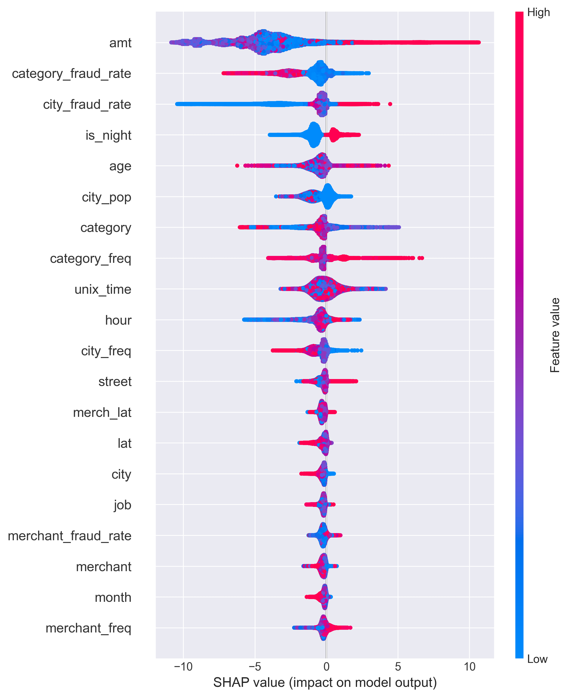
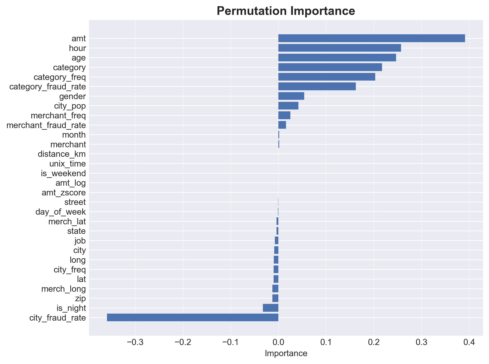

# Model Explainability

## Overview

Understanding why a model makes a specific prediction is as important as
the prediction itself — especially in fraud detection, where decisions
affect cardholders and require justification to regulators, risk teams,
and customers. This document explains the two interpretability methods
used in this project: SHAP values and permutation importance.

---

## Methods

### SHAP (SHapley Additive exPlanations)

SHAP is a framework for explaining individual model predictions by
assigning each feature a contribution score (SHAP value) for a given
prediction. It is grounded in cooperative game theory — each feature's
contribution is calculated as the average marginal contribution across
all possible feature combinations.

**In plain terms:** For any given transaction, SHAP answers the question
*"how much did each feature push the model toward or away from predicting
fraud?"*

- A **positive SHAP value** means the feature pushed the prediction
  toward fraud
- A **negative SHAP value** means the feature pushed the prediction
  away from fraud
- The **magnitude** indicates how strongly the feature influenced the
  prediction

The SHAP summary plot aggregates these individual contributions across
all test transactions, showing both the direction and magnitude of each
feature's influence across the entire dataset.

### Permutation Importance

Permutation importance measures the drop in model performance (PR-AUC)
when a feature's values are randomly shuffled — effectively breaking
the relationship between that feature and the target. A large drop
indicates the feature is important; a near-zero or negative value
indicates the feature adds no value or actively harms the model.

**Why both methods are needed:**
SHAP measures feature contribution to individual predictions, but it
cannot detect when a feature is hurting overall model performance.
A feature can have high SHAP values (appearing important) while
simultaneously introducing noise or leakage that degrades generalization.
Permutation importance catches this — it is the final arbiter of whether
a feature should be retained. Using both methods together provides a
more complete and reliable picture of feature importance.

---

## SHAP Summary Plot Findings

Features are ordered by mean absolute SHAP value (top = most impactful).
Each point represents one transaction — color indicates feature value
(red = high, blue = low).

### Top Features Explained

#### 1. `amt` — Transaction Amount
**Impact: Strongest driver of fraud predictions**

High transaction amounts (red dots) push strongly toward fraud (positive
SHAP values), while low amounts (blue dots) push away from fraud. This
is the single most important feature in the model.

**Business interpretation:** Fraudsters tend to maximize the value they
extract from a stolen card, resulting in unusually large transactions.
High-value transactions are therefore a strong fraud signal — but not
all large transactions are fraud, which is why the model uses other
features alongside `amt`.

---

#### 2. `category_fraud_rate` — Category Fraud Rate
**Impact: Second strongest driver**

High category fraud rates (red) push toward fraud; low rates (blue)
push away. The distribution is relatively tight, suggesting consistent
behavior across transactions.

**Business interpretation:** Some merchant categories carry inherently
higher fraud risk (e.g., online shopping, electronics) while others
are lower risk (e.g., grocery stores, gas stations). A transaction in
a high-risk category is more likely to be fraudulent, all else equal.

---

#### 3. `city_fraud_rate` — City Fraud Rate
**[ ! ] Present in SHAP plot but dropped from final model**

In the SHAP plot, `city_fraud_rate` shows high negative SHAP values
(blue dots pushing strongly left), meaning high city fraud rates were
pushing predictions *away* from fraud — the opposite of what would
be expected.

This counterintuitive behavior, combined with permutation importance
showing `city_fraud_rate` as the most harmful feature in the entire
dataset (importance ≈ −0.36), led to its removal. Dropping it resulted
in approximately 30–40 point improvement in both recall and F2-score.

The likely cause is noise amplification — many cities have very few
transactions, making their fraud rates unreliable even with smoothing,
and introducing misleading signal that confuses the model.

**This is a key example of why SHAP alone is insufficient for feature
selection.** SHAP showed `city_fraud_rate` as apparently impactful, but
permutation importance revealed it was actively harming the model.
Both methods must be used together.

---

#### 4. `is_night` — Night Transaction Flag
**[ ! ] Present in SHAP plot but dropped from final model**

`is_night` appeared in the SHAP plot with moderate impact — night
transactions (red) showed a slight push toward fraud. However,
permutation importance showed near-zero contribution, indicating it
added no meaningful predictive value beyond what `hour` already
captured.

Since `hour` (a continuous feature) contains all the information
that `is_night` (a binary flag) encodes — and more — `is_night`
was dropped as redundant.

---

#### 5. `age` — Cardholder Age
**Impact: Moderate**

The SHAP plot shows a spread distribution — certain age groups push
toward fraud while others push away, suggesting a non-linear
relationship between age and fraud risk.

**Business interpretation:** Fraud vulnerability varies by age group.
Older cardholders may be more susceptible to certain fraud types,
while younger cardholders may exhibit different spending patterns
that interact with fraud detection.

---

#### 6. `hour` — Hour of Transaction
**Impact: Moderate**

Certain hours push toward fraud (red at high SHAP values) while others
push away. The model has learned that fraud concentrates at specific
times of day.

**Business interpretation:** Fraudulent transactions tend to occur at
unusual hours — late night or early morning — when cardholders are
unlikely to be actively monitoring their accounts. `hour` captures
this temporal fraud pattern.

---

#### 7. `category_freq` — Category Transaction Frequency
**Impact: Moderate**

High-frequency categories (red) push slightly toward fraud, while
low-frequency categories push away.

**Business interpretation:** Very common transaction categories (high
frequency) may be preferred by fraudsters as they blend in more easily
with normal spending patterns.

---

#### 8. `city_pop` — City Population
**Impact: Low to moderate**

Larger cities (red, high population) show a slight push toward fraud.

**Business interpretation:** High-population cities have more
transactions, providing more cover for fraudulent activity. Fraud
rates may also be structurally higher in dense urban areas.

---

#### 9. `merchant_fraud_rate` — Merchant Fraud Rate
**Impact: Low**

Merchants with high fraud rates push toward fraud predictions, but
the overall SHAP magnitude is low — suggesting merchant-level fraud
rates are less discriminative than category-level rates.

**Business interpretation:** Some merchants are disproportionately
associated with fraud (e.g., compromised terminals), but at the
individual merchant level, the signal is weaker than at the category
level, possibly because individual merchant fraud rates are noisier
estimates.

---

#### 10. `merchant_freq` — Merchant Transaction Frequency
**Impact: Low**

Similar to `category_freq` but at the merchant level. Low overall
SHAP magnitude indicates this feature plays a supporting rather than
leading role in predictions.

---

## Permutation Importance Findings

Permutation importance confirmed the SHAP findings for top features
(`amt`, `hour`, `age`, `category`, `category_freq`, `category_fraud_rate`)
and provided the critical additional insight that several features were
actively harming the model:

| Feature | Permutation Importance | Decision |
|---------|----------------------|----------|
| `amt` | ~0.39 | ✅ Retained |
| `hour` | ~0.26 | ✅ Retained |
| `age` | ~0.25 | ✅ Retained |
| `category` | ~0.22 | ✅ Retained (as `category_freq`, `category_fraud_rate`) |
| `category_freq` | ~0.20 | ✅ Retained |
| `category_fraud_rate` | ~0.16 | ✅ Retained |
| `gender` | ~0.05 | ✅ Retained |
| `city_pop` | ~0.04 | ✅ Retained |
| `merchant_freq` | ~0.02 | ✅ Retained |
| `merchant_fraud_rate` | ~0.01 | ✅ Retained |
| `distance_km` | ~0.00 | ❌ Dropped — no contribution |
| `is_weekend` | ~0.00 | ❌ Dropped — no contribution |
| `amt_log` | ~0.00 | ❌ Dropped — redundant with `amt` |
| `amt_zscore` | ~0.00 | ❌ Dropped — redundant with `amt` |
| `is_night` | ~−0.08 | ❌ Dropped — slight negative impact |
| `city_fraud_rate` | ~−0.36 | ❌ Dropped — severe negative impact |

---

## Key Takeaways

1. **Transaction amount is the strongest fraud signal** — high-value
   transactions are the clearest indicator of fraud in this dataset

2. **Fraud rate encoding at category level is highly effective** —
   `category_fraud_rate` captures historical fraud patterns at a level
   of granularity that generalizes well to unseen transactions

3. **Time of day matters** — fraud concentrates at specific hours,
   making `hour` a consistently important feature

4. **Not all engineered features help** — `city_fraud_rate` appeared
   important in SHAP but severely harmed the model in practice,
   demonstrating that SHAP and permutation importance must be used
   together for reliable feature selection

5. **Simpler is better** — raw `amt` outperformed both `amt_log` and
   `amt_zscore`, confirming that tree-based models do not require
   feature scaling or transformation

---

## Sources

- SHAP: Lundberg, S. M., & Lee, S. I. (2017). *A unified approach to
  interpreting model predictions*. NeurIPS 2017.
  — Please verify citation details before publishing
- Permutation importance: Breiman, L. (2001). *Random Forests*.
  Machine Learning, 45(1), 5–32.
  — Please verify citation details before publishing